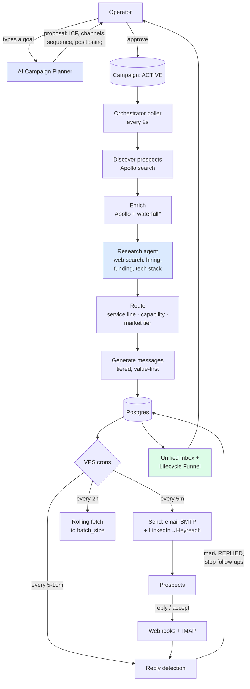

# AI Sales Agent — Architecture

A global, autonomous B2B outbound engine. You describe a goal; the system
plans the campaign, finds and researches prospects, writes personalised
messages, sends across email + LinkedIn + WhatsApp, detects replies, and
shows everything in one dashboard. You approve; it runs.

---

## The autonomous loop

`*` the enrichment waterfall (mobile numbers for WhatsApp) activates when
a provider key is set; otherwise the pipeline runs email + LinkedIn.

---

## Services (Docker Compose)

| Service | Tech | Role |
|---|---|---|
| **api** | Node/Express + TS | REST API, auth, webhooks, campaign CRUD, AI planner |
| **orchestrator** | Python | Discovery → research → routing → message generation; all cron scripts run here |
| **outreach-worker** | Python | (SQS path — idle on Hetzner; replaced by crons) |
| **reply-processor** | Python | (SQS path — idle on Hetzner; replaced by crons) |
| **dashboard** | React + Vite | Operator cockpit |
| **postgres** | PostgreSQL 16 | System of record |
| **redis** | Redis 7 | Cache / rate-limit primitives |
| **caddy** | Caddy 2 | Reverse proxy + automatic HTTPS |

On AWS the worker/reply-processor consume SQS. On the Hetzner deploy
there's no SQS, so **cron scripts on the host** drive sending, fetching,
and reply processing instead (see `scripts/vps/`).

---

## The intelligence layer (`orchestrator/src/agents/`)

| Module | What it does |
|---|---|
| `campaign_planner`* | Goal → full campaign proposal (in the API, `lib/campaignPlanner.ts`) |
| `research_agent.py` | Per-prospect web search → hiring signals, funding, tech stack, personalisation hook |
| `service_router.py` | Routes each prospect to a **service line** (AI consulting / staff aug), **capability** (SAP, Salesforce, DevOps, web, mobile, AI/ML…), and **market tier** |
| `market_tiers.py` | Country → Tier A/B/C → positioning (cost+speed / niche+quality / speed+AI-niche) |
| `enrichment_waterfall.py` | Provider-agnostic chain for mobile/email (FullEnrich, Prospeo, Datagma…) |
| `reply_recorder.py` | Shared "prospect responded" bookkeeping across all channels |
| `followup_agent.py` | Post-accept LinkedIn DM body with the meeting link |

---

## Data flow, stage by stage

1. **Plan** — `POST /api/campaigns/plan` → Anthropic designs ICP, channels,
   sequence, cadence, positioning + rationale. Operator approves →
   `POST /api/campaigns` creates it ACTIVE.
2. **Discover** — poller sees an ACTIVE campaign with < `batch_size`
   prospects → Apollo search on the ICP.
3. **Enrich** — Apollo `people/match` (email, LinkedIn URL); mobile via the
   waterfall when WhatsApp is a channel.
4. **Research** — web search per prospect → `hiring_signal` + a
   personalisation hook (gated by `ENABLE_RESEARCH_AGENT`).
5. **Route** — service line + capability + market tier written to the
   `prospects` row.
6. **Generate** — one message per channel, tiered + value-first (no rates in
   first touch), grounded in the research hook.
7. **Send** — `auto_sends.sh` (5 min): email via Workspace SMTP; LinkedIn
   pushed to Heyreach's list, campaign auto-resumed.
8. **Reply** — `poll_replies.sh` (IMAP, 10 min) + `proc_inbound.sh` (webhook
   queue, 5 min). A reply → prospect `REPLIED`, conversation stored,
   follow-ups suppressed.
9. **See** — Inbox + Lifecycle funnel + per-prospect timeline in the
   dashboard.

---

## Key database tables

| Table | Purpose |
|---|---|
| `campaigns` | Campaign config + `heyreach_campaign_id` |
| `prospects` | One per company: status, `service_line`, `capability`, `market_tier`, `hiring_signal` |
| `contacts` | Decision-makers: email, linkedin_url, whatsapp_number |
| `messages` | Per-channel drafts + send status (QUEUED→SENT→REPLIED…) |
| `conversations` / `conversation_messages` | The unified inbox threads |
| `prospect_events` | The lifecycle timeline (discovered → … → replied) |
| `inbound_events` | Durable webhook queue (WhatsApp/LinkedIn), drained by cron |
| `poller_state` | IMAP incremental cursor |

---

## Deployment (production)

- **Host**: Hetzner VPS (Ubuntu 24.04), Docker Compose.
- **URL**: `https://sales.appsontechnologies.com` (Caddy + Let's Encrypt).
- **Auth**: single-operator email + bcrypt password, JWT session cookie
  (`AUTH_MODE=local`).
- **Crons** (`scripts/vps/`): `auto_sends.sh` (5m), `rolling_fetch.sh` (2h),
  `poll_replies.sh` (10m), `proc_inbound.sh` (5m).
- **Config**: all secrets in `.env` (gitignored). `.env.example` documents
  every key.
- **Deploy**: push to GitHub → on the VPS, sync `/opt/ai-sales-agent` and
  `docker compose -f docker-compose.yml -f docker-compose.prod.yml up -d --build`.
- **AWS path**: `infrastructure/cdk/` defines the managed-services version
  (Aurora, ECS Fargate, SQS, ALB) for when scale justifies it.

---

## External integrations

| Provider | Use |
|---|---|
| **Anthropic** | Planning, research (web search), message generation |
| **Apollo** | Prospect discovery + enrichment |
| **Heyreach** | LinkedIn connection requests + DMs (list-and-pick model) |
| **Google Workspace** | Email send (SMTP) + reply detection (IMAP) |
| **Twilio** | WhatsApp templates + inbound webhooks |
| **Calendly** | Meeting booking link + (future) booked-webhook |
| **FullEnrich / Prospeo** | Mobile-number enrichment (waterfall, optional) |
